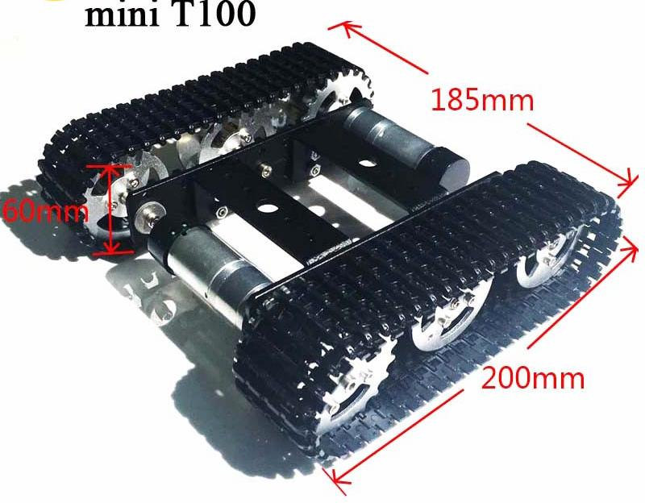
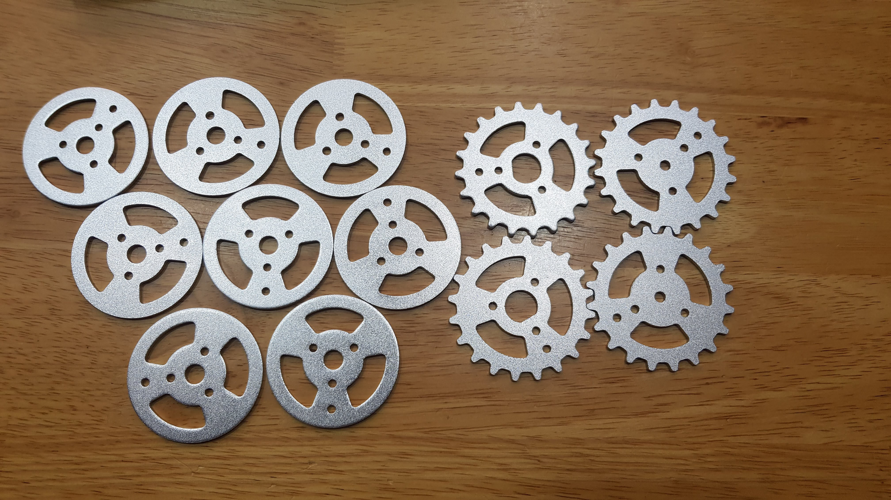
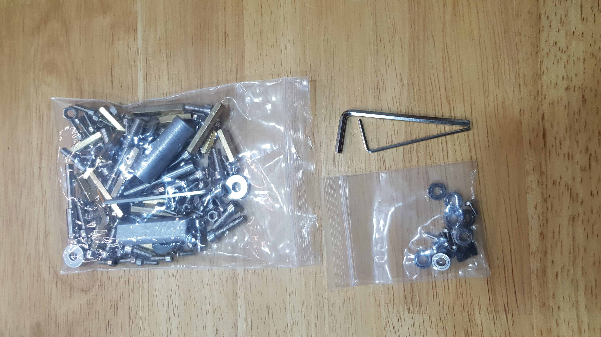
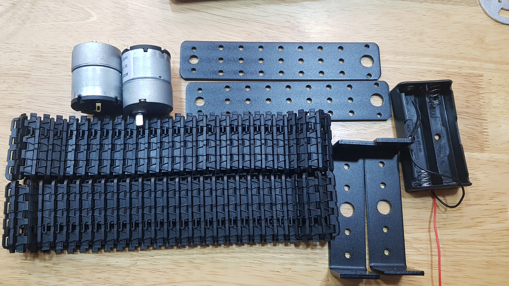
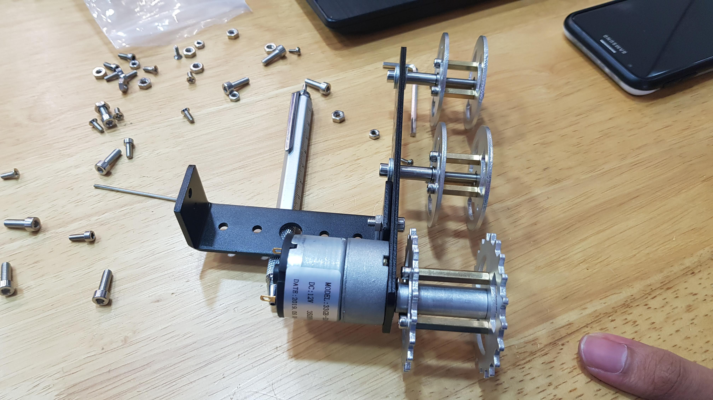
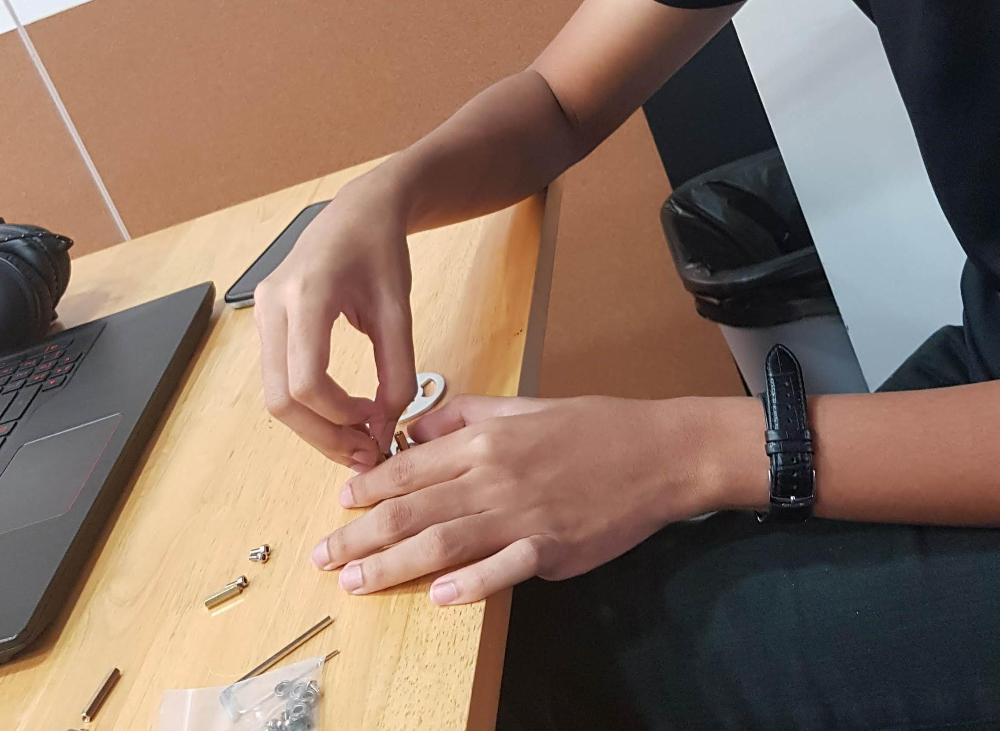
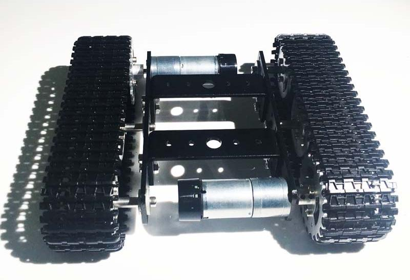
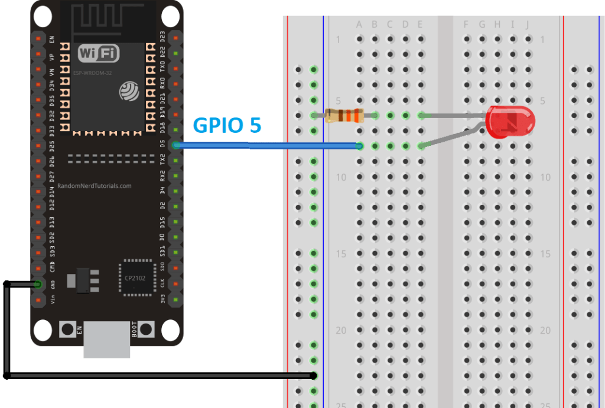
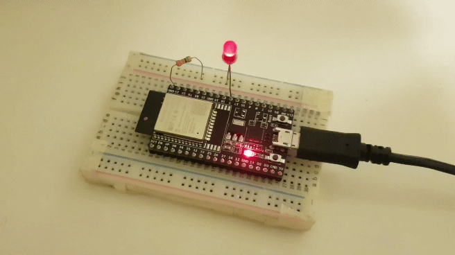

# Engineering Realisation

**Week 1**

* Module Intro
* Github Set-up
* Introduction to Markdown

**Week 2**

Micropython
Micro-controllers: esp32, microbit.

Types of Micropython IDE: https://thonny.org/, https://codewith.mu/

What?:

* Intepreted programming language created by Guido van Rossum
* First released in 1991
* Available in all platforms

Why?:

* code readability with its notable use of significant whitespace
* object-oriented approach
* aims to help programmers write code clear, logical code for small and large scale Project

Homework Assignment: https://github.com/weijuinlee/EA_Projects

**Week 3**

Continuous Track Vehicles:

 * Drive Wheel Motor Torque Calculations
 * Environmental assumptions

**T100**

Main Parameters:

 * Material: Aluminum Alloy

 * Surface treatment: sandblasting oxidation

 * Color: Black

 * Track: Engineering plastic

 * Size: About 185*200*60mm(Length*width*Height)

 * Weight: 0.65kg

 * Design load: 5kg

Motor parameters(25mm 9V 150rpm DC Motor, has hall sensor):

 * Output speed: 150±10%rpm

 * No_load Current: 200mA (Max)

 * Stall current: 4500mA(max)

 * Stall torque: 9.5kgNaN

 * Rated speed: 100±10%rpm

 * Rated torque: 3000gNaN

 * Rated Current: 1200mA (Max)

 * Noise: 56dB

 * Working voltage: 9V

 * Outside Shaft Length: 14.5mm

 * Shaft End Play: 0.05-0.50mm

 * Screw Size: M3.0

 * Dia. Of Shaft phi4mm, D3.5

 * encoder: 2 pulses/circle
 

Equipment List:

  1. 1 x Chassis bracket

  2. 1 x Track (pair)

  3. 2 x Driving wheels

  4. 4 x Wheel drive

  5. 1 x Motor (pair) (with encoder)

**Assembly of T100:**

  1.  
  
  

  2.  
  
  

  3.  

  

  4.  
  
  

  5.  

  

  6.  
  
  

**Week 4**

Flashing of micropython on ESP32 and controlled LED: https://learn.adafruit.com/micropython-basics-blink-a-led/blink-led

**Week 5**

ESP 32 documentation brief.

**Week 6**

Tutorial on mechanical drawing on Fusion 360.

**Week 7**

Clas on Power Management.

