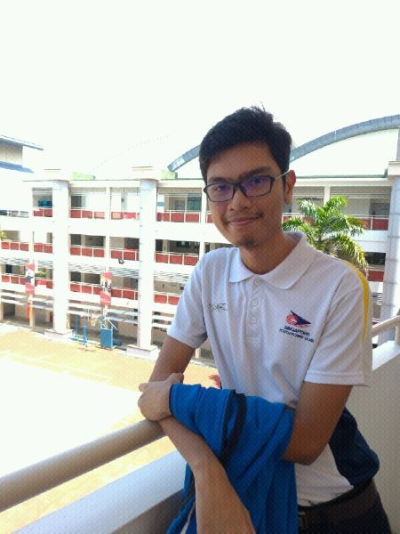
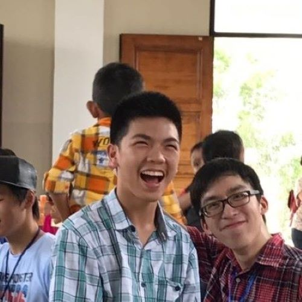
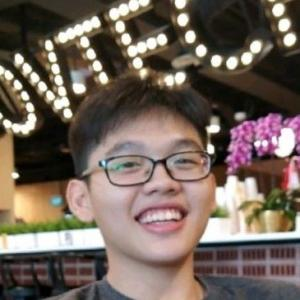
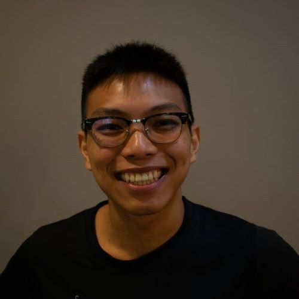

# About Us
"Hello and welcome to our blog! Here are some basic information about us, the people behind this tracked vehicle project"

**Ahmad Rifaaie Bin Mohamed Ali**

Rifaaie, or in short, Rif, is our mechanical guy of the group who handles anything related to the mechanics of our tracked vehicle. Has good mechanical and some electrical knowledge.

Link to Rifaaie's Github:

<a href="https://github.com/ahmadrifaaie">https://github.com/ahmadrifaaie

**Hans Delano**

Hans, he is our coding guy, who has skills in electrical and computer programming. He helps out in programming the tracked vehicle to carry out its purpose.

Link to Hans' Github:

<a href="https://github.com/hanscau">https://github.com/hanscau

**Jabez Tho Ngee Qi**

Jabez, our coding guy again, who forms a good duo with Hans to code our track vehicle up to date, has good electrical and coding knowledge.

Link to Jabez's Github:

<a href="https://github.com/Jasperabez">https://github.com/Jasperabez

**Lee Wei Juin**

And finally, Wei Juin, he has good electrical and coding knowledge. He helps to ensure the electrical requirements needed for the track vehicle are met.

Link to Wei Juin's Github:

<a href="https://github.com/weijuinlee">https://github.com/weijuinlee
