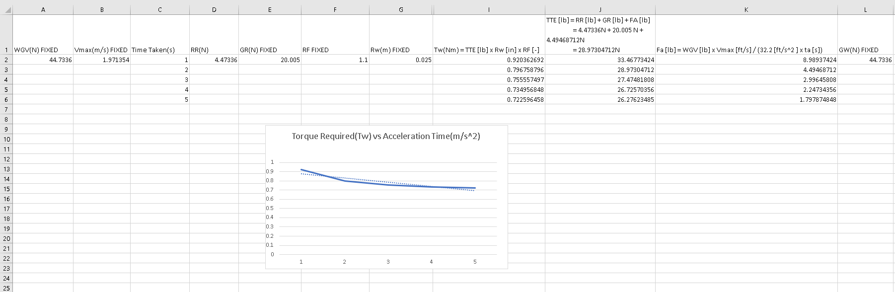
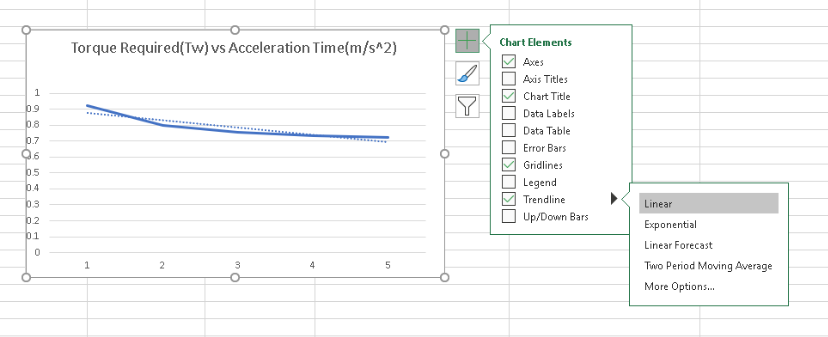
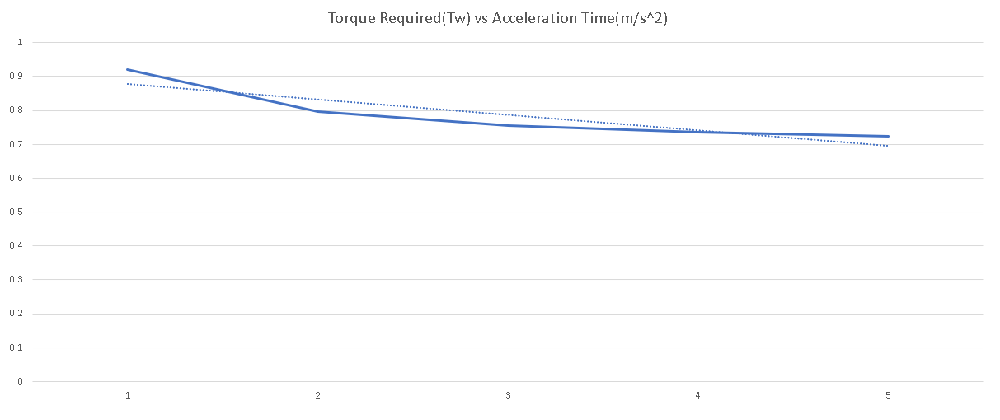

---
layout: post
title: References 
---

# The Mechanical Bible
"God once said 'Let there be physics', hence we humans came up with all sorts of calculations there is known, and here, be the great formulas and walkthroughs"

Formulas:

**V(speed)(m/s)** = r(radius) x rpm(revolutions per minute) x 0.10472(2pi/60)(constant)

**Angular velocity(rad/s)** = rpm x 0.10472(constant to convert rpm to rad/s)

**Acceleration(aMax)** = Vmax / s

**Rolling Resistance(N)** = Gross Weight of Vehicle(N) x Surface Friction Coeff

**Grade Resistance(N)** = Gross Weight of Vehicle(N) x incline angle(BCA)(degrees)

**Acceleration Force(N)** = Gross Weight of Vehicle(N) x Vmax(m/s) x time required to Vmax(s)

**Total Tractive Effort(N)** = Rolling Resistance(N) + Grade Resistance(N) + Acceleration Force(N)

**Wheel Torque(Tw)(N)** = Total Tractive Effort(N) x Radius of Wheel(0.025m) x Resistance Factor(1.1 to 1.15)

**Maximum Tractive Torque(N)** = Weight on drive wheel(N) x static friction coeff between wheel and ground x radius of wheel(N)

Constants:

**Radius of track vehicle wheel** = 0.025m

**Constant to convert rpm to m/s** = 0.10472

After familiarizing with the formulas, here are the steps to take to calculate all the mechanical aspects, all the way to Wheel Torque. I will use my own calculations to show you

<u>**STEP 1: CALCULATING VMAX(MAXIMUM SPEED)**</u>

Vmax = radius x revolutions per minute x 0.10472
              
    = 0.025 x 753 x 0.10472
    = 1.971354m/s

<u>**STEP 2: CALCULATING ACCELERATION TIME USING VMAX AND TIME**</u>

Acceleration(aMax) = Vmax / s 
                                      
    = 1.971354 / 2
    = 0.985677 m/s^2

<u>**STEP 3: CALCULATING WEIGHT OF GROCERIES AND TOTAL WEIGHT**</u>

There are two steps, one to calculate with just the **total weight of groceries** and **total weight of the vehicle with the load**(total weight of groceries)

Weight of Groceries = 

    (3*200)g (Darlie Double Action Toothpaste)
    + (50*2)g (OSK Japanese Green Tea Bags)
    + (1000)g (Milo Powder Bag)
    + (360)g (Julie's Sandwich Biscuits)
    + (1500)g (Pasar Fresh Eggs)
    = 3560g 
    = 3.56kg  

Total Weight = 

    (1000)g + (3560)g 
    = 4560g 
    = 4.56kg

<u>**STEP 4: CALCULATING WHEEL TORQUE(TW) VALUE**</u>

There will be many steps involved in this, which is the calculation of Rolling Resistance, Grade Resistance, Acceleration Force, Total Tractive Effort and finally, Wheel Torque.

**Rolling Resistance(Rr) [N]** = Gross Weight of Vehicle(Gw)[N] x Surface Friction Coeff(SFc)
     
    = 4.56kg * 9.81(convert to Force(N)) (44.7336N) * 0.01 (Good Concrete Contact Surface)
    = 0.447336N
     
**Grade Resistance(GR) [N]** = Gross Weight of Vehicle(WGV) [N] x sin(θ)(degrees)
   
    = 44.7336N * sin(26.565 °)
    = 20.005 N 

**Acceleration Force [N]** = Gross Weight of Vehicle(WGV) [N] x Vmax [m/s] / (32.2 [m/s^2 ] x Time [s]) 
    
    = (44.7336N * 1.971354m/s) / (9.81m/s^2 * 2s)
    = 4.49468712N

**Total Tractive Effort [N]** = Rolling Resistance [N] + Grade Resistance [N] + Acceleration Force [N]
                  
    = 0.447336N + 20.005 N + 4.49468712N
    = 24.49968712N 

 Lastly, **Wheel Torque[Nm]** = Total Tractive Effort [N] x Radius of Wheel[m] x Resistance Factor [-] 
                    
    = 28.97304712N * 0.025m * 1.1
    = 0.7967587958Nm

<u>**STEP 5: CALCULATING GRAPH OF TW VS ACCELERATION TIMES(1-5 SECONDS)**</u>

Note, you will have to use excel, so you have sub in the values for the acceleration times and wheel torque.

As you can see below, I had to sub in my values so I could get the graph.

You should only highlight the Tw values and go to the **Insert Tab** 

and find the **Line or Area Chart Option**. (Make sure only your Wheel Torque values are highlighted!)

Finally, to set up the best-fit line, select the + symbol when you click on your graph, go to Trendline and select **Linear**, as shown below.

Congratulations! You managed to complete the required steps for the assignment. The bonus question is still a work in progress.

