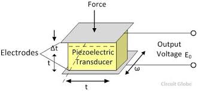
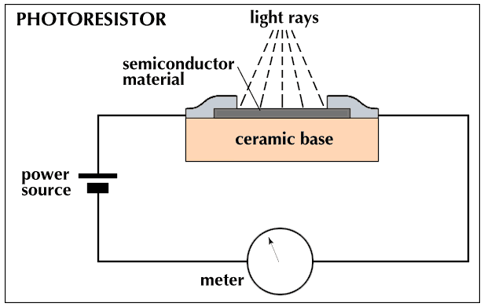

---
layout: post
title: Basic 10
---

This is an introduction to basic Fan In/Out, Signal Level Conversion and Output in a Microcontroller set-up.

# Fan In / Out

Under construction.

# Transducers

Sensors and transducers are considered as energy conversion devices which receive a physical data such as temperature, pressure or light intensity and generate an electrical signal such as voltage depending on the type of transducer. Transducers can then be divided into two categories: **Active** or **Passive**

### Active 

An active transducer generates electrical signal in response to the physical parameter and does not require electrical energy in doing so.

#### Example: Piezoelectric sensor

### Passive

A passive transducer requires external energy for it's operation. 

#### Example: Photoconductive Devices

#### Switch (On/Off)

The resistive passive sensor changes value (electrical) when the physical quantity (e.a. temperature, force, light etc) changes. These sensors can (generally) be used in combination with an extra resistor, like described above. The most common sensor is a switch. A switch is actually a resistor with two states: infinite and zero. When a switch has to be connected to the analog input of a sensor-interface, the same series resistor as mentioned before is needed.

A good value of the series resistor R1 will be between 10K-50K. In rest situation (switch is not pushed), the output will be +5V. When the switch is pushed, the resistance will be zero (shortcut to gnd) and the output voltage will be 0V.

Things to consider when choosing a transducer:

1. Linearity

2. Sensitivity

3. Dynamic range

4. Repeatability

5. Physical Size

# Output

Under construction.

