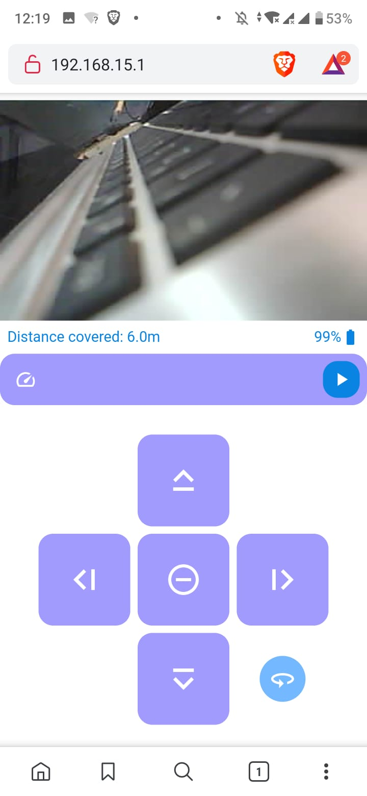

In reference to our last post on implementing video stream using iframe, we did felt that it was kind of hackish in nature. In addition to that, the refreshes seems to damper our user experience.

To resolve the problem we thought of using javascript to send HTTP request to our server, a technique better known by the name Ajax. This enables to skip decoupling the video stream and buttons all together.

Besides implementing Ajax we also took the opportunity to polish our web console to make it more appealing and user friendly and did some code cleaning by saving the html in an external file.

The new html is as below:

```html
<html>

<head>
    <title>ESP Web Server</title>
    <meta name="viewport" content="width=device-width, initial-scale=1">
    <link rel="icon" href="data:,">
    <style>
        html,
        body,
        * {
            margin: 0;
            padding: 0;
            font-family: Helvetica;
        }

        .spacer {
            flex: 1 1 auto;
        }

        .container {
            margin: auto;
            width: 400px;
            height: 100%;
            padding-top: 8px;
            box-sizing: border-box;
        }

        .myImg {
            height: auto;
            max-height: 240px;
            max-width: 520px;
            width: 100%;
        }

        .state_holder {
            border: 3px #0984e3 solid;
            border-radius: 16px;
        }

        .robot_state {
            font-size: 1.4em;
            text-align: left;
            font-family: Helvetica;
            padding: 16px;
            color: #0984e3;
            border-radius: 16px;
        }

        .info_holder {
            padding: 8px;
            display: flex;
        }

        .distance {
            color: #0984e3;
        }

        .battery_holder {
            display: flex;
            color: #0984e3;
        }

        .battery__img {
            margin-top: 0;
        }


        .control_holder {
            margin: 32px auto;
            display: grid;
            width: 316px;
            grid-template-columns: 1fr 1fr 1fr;
            grid-template-rows: 1fr 1fr 1fr;
            grid-template-areas: ". up .""left middle right"". down blade";
            gap: 8px;
            justify-items: center;
            align-items: center;
        }

        .button {
            width: 100px;
            height: 100px;
            background-color: #a29bfe;
            display: flex;
            align-items: center;
            justify-content: center;
            border-radius: 16px;
            transition: all 0.2s;
        }

        .button:hover {
            background-color: #74b9ff;
        }

        .button:active {
            background-color: #6c5ce7;
        }

        .up {
            grid-area: up;
        }

        .right {
            grid-area: right;
            justify-self: left;
            transform: rotate(90deg);
        }

        .left {
            grid-area: left;
            justify-self: right;
            transform: rotate(-90deg);
        }

        .middle {
            grid-area: middle;
        }

        .down {
            grid-area: down;
            transform: rotate(180deg);
        }

        .blade {
            grid-area: blade;
            border-radius: 50%;
            background-color: #0984e3;
            width: 50%;
            height: 50%;
        }

        .speed_holder {
            margin-bottom: 16px;
        }

        .speed {
            width: 100%;
            display: flex;
            background-color: #a29bfe;
            padding: 8px;
            box-sizing: border-box;
            border-radius: 16px;
        }

        .speed__img {
            margin-right: 8px;
            padding: 8px;
        }

        .speed__input {
            color: white;
            flex: 1 1 auto;
            padding: 8px;
            margin-right: 8px;
            background-color: #a29bfe;
            border: none;
            font-family: Helvetica;
        }

        .speed__btn {
            background-color: #0984e3;
            color: white;
            padding: 8px;
            border-radius: 16px;
            border: none;
            transition: all 0.2s;
        }

        .speed__btn:hover {
            background-color: #0e65a7;
        }
    </style>


    <script>
        function sendBtnCommand(btnDirection) {
            var button = document.getElementById(btnDirection);
            var command = button.getAttribute("href");

            var xhttp = new XMLHttpRequest();
            xhttp.onreadystatechange = function () {
                if (this.readyState == 4 && this.status == 200) {
                    // console.log("respond received");
                    // console.log(xhttp.responseText);
                    document.getElementById("demo").innerHTML =
                        xhttp.responseText;
                    // sendAJAX();
                }
            };
            xhttp.open("GET", command, true);
            console.log("Sent command: " + command);
            xhttp.send();

            return false;
        }
    </script>

    <script>
        function submitSpeed() {
            var form = document.getElementById("speedEntry");
            speed = document.getElementById("speedValue").value;
            speed = parseInt(speed, 10)
            if (Number.isInteger(speed) && speed >= 0 && speed <= 100) {

                var xhttp = new XMLHttpRequest();
                xhttp.onreadystatechange = function () {
                    if (this.readyState == 4 && this.status == 200) {
                        // console.log("respond received");
                        // console.log(xhttp.responseText);
                        // sendAJAX();
                    }
                };
                xhttp.open("GET", "?speed=" + speed, true);
                console.log("Sent command: " + speed);
                xhttp.send();

            }
            else {
                window.alert("Not valid case, need to be between 0 and 100")
            }
        }
    </script>
    <script>
        document.getElementById('speedValue').addEventListener('keypress', function (event) {
            if (event.keyCode == 13) {
                event.preventDefault();
                submitSpeed();
            }
        })
    </script>


</head>

<body>

    <div class="container">

        

        <!-- <div class="state_holder">
            <p class="robot_state">Robot state: <strong>""" + robot_state + """</strong></p>
            <p class="robot_state">Blade: <strong>""" + blade_state + """</strong></p>
            <p class="robot_state">Speed: <strong>""" + speed_val + """</strong></p>
            <p class="robot_state">Blade: <strong>""" + str(batt_lvl) + """</strong></p>
            <p class="robot_state">Blade: <strong>""" + str(dist_covered) + """ m</strong></p>
        </div> -->

        <div class="info_holder">
            <div class="distance_holder">
                <p class="distance">Distance covered: 6.0m</p>
            </div>
            <div class="spacer"></div>
            <div class="battery_holder">
                <p class="battery__lvl">
                    99%
                </p>
                <svg class="battery__img" xmlns="http://www.w3.org/2000/svg" height="20" viewBox="0 0 24 24" width="20">
                    <path d="M0 0h24v24H0z" fill="none" />
                    <path
                        d="M15.67 4H14V2h-4v2H8.33C7.6 4 7 4.6 7 5.33v15.33C7 21.4 7.6 22 8.33 22h7.33c.74 0 1.34-.6 1.34-1.33V5.33C17 4.6 16.4 4 15.67 4z"
                        fill="#0984e3" />
                </svg>
            </div>
        </div>

        <form id="speedEntry" class="speed_holder" action="./">
            <div class="speed">
                <svg class="speed__img" xmlns="http://www.w3.org/2000/svg" height="24" viewBox="0 0 24 24" width="24">
                    <path d="M0 0h24v24H0z" fill="none" />
                    <path
                        d="M20.38 8.57l-1.23 1.85a8 8 0 0 1-.22 7.58H5.07A8 8 0 0 1 15.58 6.85l1.85-1.23A10 10 0 0 0 3.35 19a2 2 0 0 0 1.72 1h13.85a2 2 0 0 0 1.74-1 10 10 0 0 0-.27-10.44zm-9.79 6.84a2 2 0 0 0 2.83 0l5.66-8.49-8.49 5.66a2 2 0 0 0 0 2.83z"
                        fill="white" />
                </svg>
                <input class="speed__input" type="text" id="speedValue" name="speed">
                <svg onclick="submitSpeed()" class="speed__btn" xmlns="http://www.w3.org/2000/svg" height="24"
                    viewBox="0 0 24 24" width="24">
                    <path d="M8 5v14l11-7z" fill="white" />
                    <path d="M0 0h24v24H0z" fill="none" /></svg>
            </div>
        </form>

        <div class="control_holder">

            <div class="button up" type="button" onClick="sendBtnCommand('up_btn')" href="/?robot=forward" id="up_btn">
                <svg xmlns="http: //www.w3.org/2000/svg" height="45" viewBox="0 0 24 24" width="45">
                    <path d="M12 8.41L16.59 13 18 11.59l-6-6-6 6L7.41 13 12 8.41zM6 18h12v-2H6v2z" fill="white" />
                    <path d="M0 0h24v24H0z" fill="none" />
                </svg>
            </div>
            <div class="button left" type="button" onClick="sendBtnCommand('left_btn')" href="/?robot=left"
                id="left_btn">
                <svg xmlns="http: //www.w3.org/2000/svg" height="45" viewBox="0 0 24 24" width="45">
                    <path d="M12 8.41L16.59 13 18 11.59l-6-6-6 6L7.41 13 12 8.41zM6 18h12v-2H6v2z" fill="white" />
                    <path d="M0 0h24v24H0z" fill="none" />
                </svg>
            </div>
            <div class="button middle" type="button" onClick="sendBtnCommand('stop_btn')" href="/?robot=stop"
                id="stop_btn">
                <svg xmlns="http://www.w3.org/2000/svg" height="40" viewBox="0 0 24 24" width="40">
                    <path d="M0 0h24v24H0z" fill="none" />
                    <path
                        d="M7 11v2h10v-2H7zm5-9C6.48 2 2 6.48 2 12s4.48 10 10 10 10-4.48 10-10S17.52 2 12 2zm0 18c-4.41 0-8-3.59-8-8s3.59-8 8-8 8 3.59 8 8-3.59 8-8 8z"
                        fill="white" /></svg>
            </div>
            <div class="button right" type="button" onClick="sendBtnCommand('right_btn')" href="/?robot=right"
                id="right_btn">
                <svg xmlns="http: //www.w3.org/2000/svg" height="45" viewBox="0 0 24 24" width="45">
                    <path d="M12 8.41L16.59 13 18 11.59l-6-6-6 6L7.41 13 12 8.41zM6 18h12v-2H6v2z" fill="white" />
                    <path d="M0 0h24v24H0z" fill="none" />
                </svg>
            </div>
            <div class="button down" type="button" onClick="sendBtnCommand('back_btn')" href="/?robot=backward"
                id="back_btn">
                <svg xmlns="http: //www.w3.org/2000/svg" height="45" viewBox="0 0 24 24" width="45">
                    <path d="M12 8.41L16.59 13 18 11.59l-6-6-6 6L7.41 13 12 8.41zM6 18h12v-2H6v2z" fill="white" />
                    <path d="M0 0h24v24H0z" fill="none" />
                </svg>
            </div>
            <div class="button blade" type="button" onClick="sendBtnCommand('blade_btn')" href="/?robot=blade_toggle"
                id="blade_btn">
                <svg xmlns="http://www.w3.org/2000/svg" height="30" viewBox="0 0 24 24" width="30">
                    <path
                        d="M12 7C6.48 7 2 9.24 2 12c0 2.24 2.94 4.13 7 4.77V20l4-4-4-4v2.73c-3.15-.56-5-1.9-5-2.73 0-1.06 3.04-3 8-3s8 1.94 8 3c0 .73-1.46 1.89-4 2.53v2.05c3.53-.77 6-2.53 6-4.58 0-2.76-4.48-5-10-5z"
                        fill="white" />
                    <path d="M0 0h24v24H0z" fill="none" />
                </svg>
            </div>
        </div>

    </div>


</body>

</html>
```

on the python file nothing was changed.

and it looks good!!



Besides making the site looks better, using Ajax we could have implemented advanced features such as a virtual joystick which was definitely not possible with plain html.

