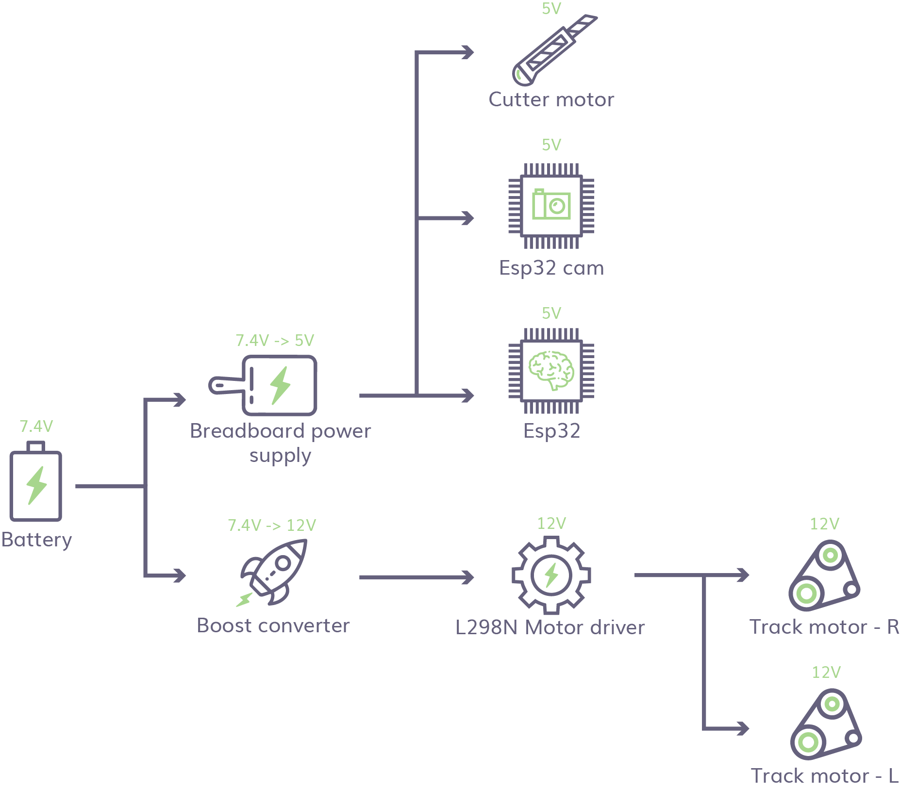
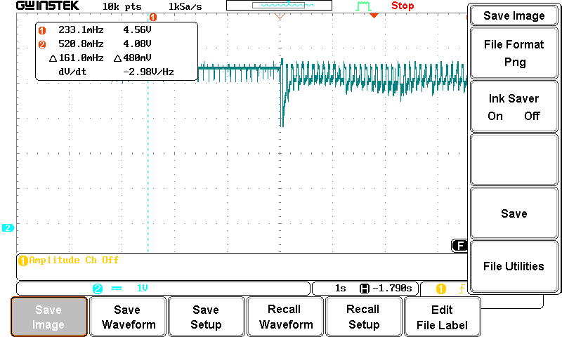
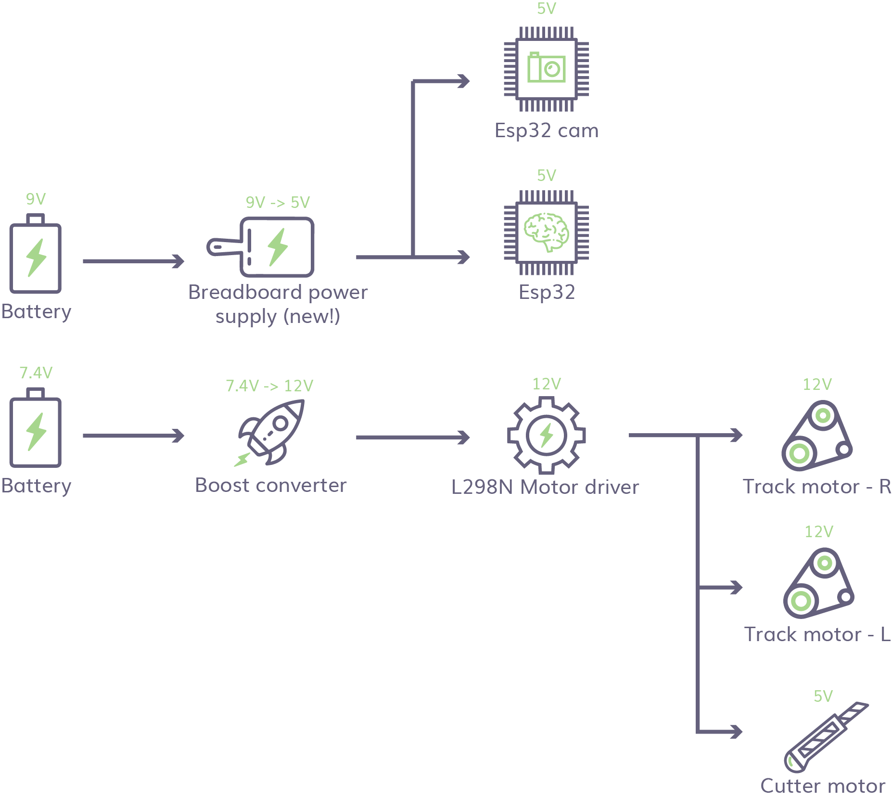
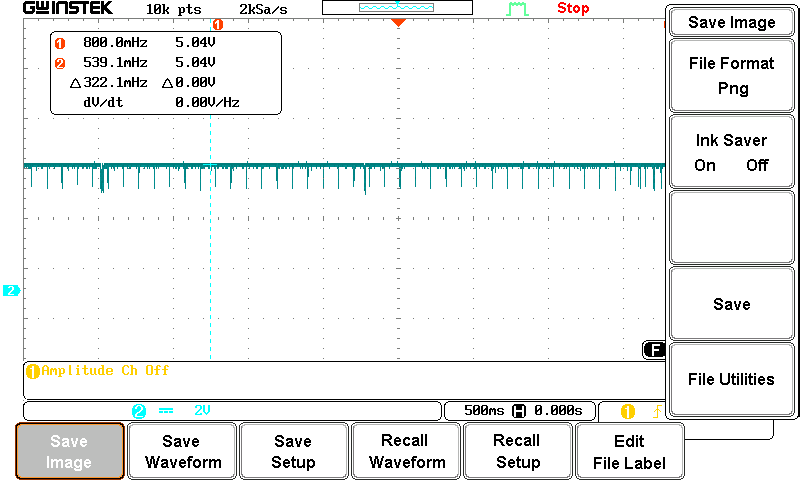

Power management is no easy task, especially if your build require the use of a DC motor. There is the problem of the powering the DC motor, the immense start up power draw and the back emf that accompanies the powering down of a DC motor. 

# Previous power structure

This was our original power distribution for our TrackerBot. We were using 1 power supply that is boosted on 1 end to power up the motors and stepped down on the other to power our Esp32, Esp32 cam and cutter motor.

However, whenever we connect to our bot and start up its motor. Out access point provided by our Esp32 will reset. To figure out what is happening, we used an oscilloscope to visual our power draw. 

Here is what we see.

The above shows our power draw when the TrackerBot is powered and when the motor is first started up. The initial draw of the DC motor is so high, that the power to our Esp32 dipped to the point of not having enough power to supply to the Esp32. 

So to counter this, we decoupled the power supply of our DC motors and our Esp32s.

After changing our connection like so, we tested to see if our motor draw is affecting our Esp32.

As you can see, clean straight lines. Stable power to our Esp32s for days...