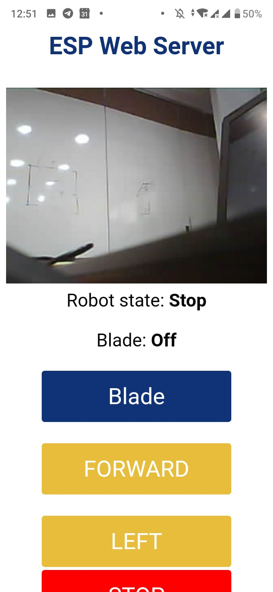

While adding video stream to our simple web server, we realized an issue. 

The buttons controling the movement which are basically just href to send http request to the server always force "refreshes" the page hence the streaming was always getting cut.

To solve this problem we thought of a way to decouple the video stream and the control buttons, which is to use iframes.

The approach was such:

1. Video stream served in the main frame
2. buttons nested in the iframe

However we realized there was not a way for us to reference another html in the iframe tag.

We ended up coding it in such a way thar the web server sends different html accordingly.

```python
do_ap()

try:
  import usocket as socket
except:
  import socket

import tracker
import oled_display
import esp
import time
esp.osdebug(None)

import gc
gc.collect()

batt_lvl=99
dist_covered=100
bot = tracker.Tracker(14,12,13,25,26,27,32)
robot_state = "Stop"
blade_state = "Off"
speed_val = 50
bot_oled = oled_display.Oled_display(robot_state,str(speed_val),batt_lvl,dist_covered);
bot.setup()

def web_page():
  
  html = """
    <html>
        <head> 
            <title>ESP Web Server</title>
            <meta name="viewport" content="width=device-width, initial-scale=1">
            <link rel="icon" href="data:,"> 
            <style>
                html{font-family: Helvetica; display:inline-block; margin: 0px auto; text-align: center;}
                h1{color: #0F3376; padding: 2vh;}p{font-size: 1.5rem;}
                .button{display: inline-block; background-color: #e7bd3b; border: none; border-radius: 4px; color: white;  padding: 16px 40px; text-decoration: none; font-size: 30px; margin: 2px; cursor: pointer;}
                .buttonStop{background-color: red;}
                .myIFrame {
                  height:700px;
                  width:100%;
                  border:0;
                }
                .myImg {
                  height: auto;
                  max-width: 520px;
                  width:100%;
                }
            </style>
        </head>
        <body> 
            <h1>ESP Web Server</h1> 
                
                <iframe class="myIFrame" src="iframe"></iframe>
        </body>
    </html>
    """
  return html

def iframe():
  html = """
    <html>
      <head>
        <title>ESP Web Server</title>
        <meta name="viewport" content="width=device-width, initial-scale=1">
        <link rel="icon" href="data:,"> 
        <script>
          function submitSpeed(){
            var form = document.getElementById("speedEntry");
            speed = document.getElementById("speedValue").value;
            speed = parseInt(speed,10)
            if(Number.isInteger(speed) && speed>=0 && speed<=100){
              form.submit();
            }
            else{
              window.alert("Not valid case, need to be between 0 and 100")
            }
          }
        </script>
        <style>
            html{font-family: Helvetica; display:inline-block; margin: 0px auto; text-align: center;}
            h1{color: #0F3376; padding: 2vh;}p{font-size: 1.5rem;}
            .button{width:250px;display: inline-block; background-color: #e7bd3b; border: none; border-radius: 4px; color: white;  padding: 16px 40px; text-decoration: none; font-size: 30px; margin: 2px; cursor: pointer;}
            .buttonStop{background-color: red;}
            .button--blade {
              background-color: #0F3376;
            }
        </style>
      </head>
      <body>
        <p>Robot state: <strong>""" + robot_state + """</strong></p>
        <p>Blade: <strong>""" + blade_state + """</strong></p>
        <p>Battery Level: <strong>""" + str(batt_lvl) + """</strong></p>
        <p>Distance Travelled: <strong>""" + str(dist_covered) + """ metres</strong></p>
        <p>Speed: <strong>""" + str(speed_val) + """ metres</strong></p>
        <p><a href="/?robot=blade_toggle"><button class="button button--blade">Blade</button></a></p>
        <p><a href="/?robot=forward"><button class="button">FORWARD</button></a></p>
        <p>
          <a href="/?robot=left"><button class="button">LEFT</button></a>
          <a href="/?robot=stop"><button class="button buttonStop">STOP</button></a>
          <a href="/?robot=right"><button class="button">RIGHT</button></a>
        </p>
        <p><a href="/?robot=backward"><button class="button">BACKWARD</button></a></p>
        <form id="speedEntry" action="./">
          <input type="text" id="speedValue" name="speed"><br><br>
          <input type="button" onclick="submitSpeed()" value="Submit">
        </form>
        <script>
          document.getElementById('speedValue').addEventListener('keypress', function(event) {
          if (event.keyCode == 13) {
              event.preventDefault();
              submitSpeed();
          }
          })
        </script>
      </body>
    </html>
    """
  return html

s = socket.socket(socket.AF_INET, socket.SOCK_STREAM)
s.bind(('', 80))         
s.listen(5)

while True:
  conn, addr = s.accept()
  print('Got a connection from %s' % str(addr))
  request = conn.recv(1024)
  request = str(request)
  print('Content = %s' % request)
  request_iframe = request.find('/iframe')
  robot_stop = request.find('/?robot=stop')
  robot_forward = request.find('/?robot=forward')
  robot_backward = request.find('/?robot=backward')
  robot_right = request.find('/?robot=right')
  robot_left = request.find('/?robot=left')
  speed_change = request.find('/?speed=')
  blade_toggle = request.find('/?robot=blade_toggle')
  isControlKey = False
  if speed_change == 6:
    try:
      speed_val = int(request[14:17])
    except:
      speed_val = int(request[14:16])
    print(speed_val)
    bot.setSpeed(speed_val)
  if robot_stop == 6:
    print('robot stopping...')
    robot_state = "Stop"
    bot.stop()
    isControlKey = True
  if robot_forward == 6:
    print('robot advancing forward...')
    robot_state = "Forward"
    bot.forward()
    isControlKey = True
  if robot_backward == 6:
    print('robot retreating backward...')
    robot_state = "Backward"
    bot.backward()
    isControlKey = True
  if robot_right == 6:
    print('robot turning right...')
    robot_state = "Right"
    bot.right()
    isControlKey = True
  if robot_left == 6:
    print('robot turning left...')
    robot_state = "Left"
    bot.left()
    isControlKey = True
  if blade_toggle == 6:
    print('toggling blade')
    blade_state = bot.blade_toggle(blade_state)
    isControlKey = True
  if request_iframe == 6:
    response = iframe()
  elif isControlKey == True:
    response = iframe()
  else:
    response = web_page()
  bot_oled.display(robot_state,str(speed_val),batt_lvl,dist_covered)
  conn.send('HTTP/1.1 200 OK\n')
  conn.send('Content-Type: text/html\n')
  conn.send('Connection: close\n\n')
  conn.sendall(response)
  conn.close()
```

you can see from our code 

```html
<iframe class="myIFrame" src="iframe"></iframe>
```

that the src doesn't calls to anywhere since it is not a valid destination, however we are able to send back the iframe html as the src is basically another http request so we handled it at the web server logic.

```python
if request_iframe == 6:
    response = iframe()
  elif isControlKey == True:
    response = iframe()
  else:
    response = web_page()
```

this is done as shown above.

We have to check whether it is a "ControlKey" (the buttons) so that when the button is pressed the href that it sends will return only the iframe html instead of the response html. Else you'll get a looping stack of html.

After you are done seat back and relax at your glorious web console, thinking about what to improve next.

